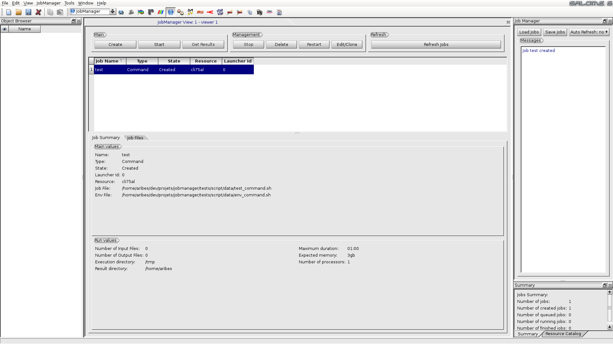
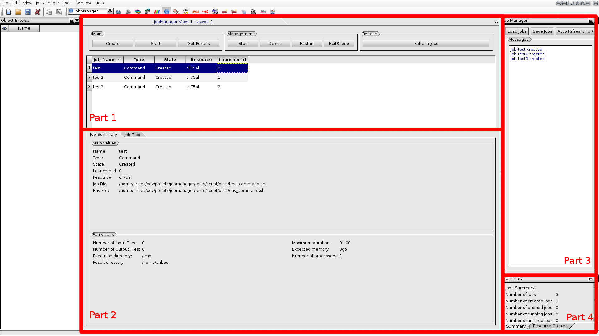

Introduction: What is the JOBMANAGER ?
======================================

The JOBMANAGER module allows creating, launching and following 
calculation jobs on different types of computers. 

  **Overview of the JOBMANAGER module**

Main functionalities
++++++++++++++++++++

The JOBMANAGER module permits to define three types of jobs:

- User scripts.
- Python scripts launched in a SALOME session.
- YACS schemas.

The module handles different types of computational resources:

- Interactive computers (rsh, ssh).
- Clusters managed by batch systems like PBS, LSF or SGE.

User's job list could be saved and loaded. Finally, the module provides
an editor for managing user's SALOME resources.

General description of the GUI
++++++++++++++++++++++++++++++

JOBMANAGER's GUI is divided in four parts:

- Part 1 shows the user job list. It also provides many buttons
  to manage a job (create, delete, start, ...).
- Part 2 shows the parameters of the job selected in the list of part 1.
  It's divided in two tabs. The first is for the general information, the second
  is dedicated to the files.
- Part 3 provides a text widget dedicated of SALOME messages. It provides 
  the buttons for loading or saving the job list. It also provides an auto refresh button.
- Part 4 is divided in two tabs. The first tab provides a summary of user's jobs status.
  The second tab provides the SALOME resource editor.

  **The JOBMANAGER GUI is divided in four parts**
