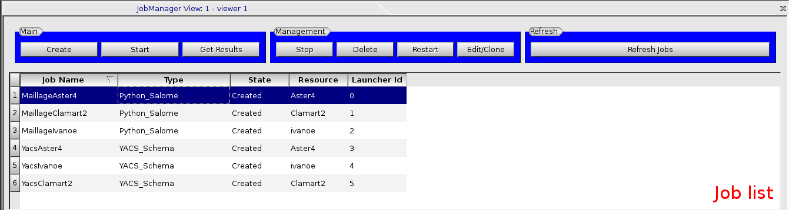

Using the JOBMANAGER GUI
========================

Job management with the GUI
---------------------------

This section describes the parts 1 and 2 (described in the introduction section) of the JOBMANAGER GUI 
dedicated to the management of jobs.

JOBMANAGER provides some buttons to manage the user job list (see figure :ref:`figure_jobmanager_main_buttons`).

.. _figure_jobmanager_main_buttons:

  **Main buttons for job management and job list**

The description of each button (framed in blue in the figure) is given in the table below. 

======================== ============================ ================================================================
**Button**               **Condition of activation**  **Description**
======================== ============================ ================================================================
**Create a job**         Always activated             Launch the job wizard to create a job.
**Edit/Clone a job**     Job selected                 Edit a job in *created* or *Error* or *Failed* or *Not Created*
                                                      state. Clone a job in other state.
**Start a job**          Job selected and job state   Start a job.
                         equals to *Created*
**Restart a job**        Job selected and job state   Restart a job.
                         equals to *Finish* or 
                         *Failed*
**Delete a job**         Job selected                 Delete a job.
**Get job results**      Job selected and job state   Get job results in the result directory.
                         equals to *Finish* or 
                         *Failed*
**Refresh jobs**         Always activated             Update jobs states.
======================== ============================ ================================================================

**Tip:** You could use the **Auto Refresh** button in GUI part 3 to enable an automatic refresh.

When a job is selected, the part 2 is filled with all the information that the JOBMANAGER has on the job. The figure
:ref:`figure_jobmanager_job_focus` shows this part of the GUI. It contains two tabs. The first tab provides the main 
information and the run information. The second tab shows the input and output file list of the job.

.. _figure_jobmanager_job_focus:

  **Job widget information**

Job creation workflow
---------------------

This section describes the workflow when a job is created. The jobmanager uses a wizard to create a job.

The first page (see :ref:`figure_jobmanager_job_workflow_1`) of the wizard permits to define the **job name** 
and the **job type**. For each job type, the page provides an explanation of what job type refers.

.. _figure_jobmanager_job_workflow_1:

  **Create wizard page 1**

The second page (see :ref:`figure_jobmanager_job_workflow_2`) permits to add two files, the main job file 
(in this example a command file). You could also add an environment file that is not mandatory.

.. _figure_jobmanager_job_workflow_2:

  **Create wizard page 2**

The third page (see :ref:`figure_jobmanager_job_workflow_3`) permits to define the batch parameters related
to the job. It's mandatory to define the *Remote work directory* that is the directory where the job will be executed.
Input files defined in page 4 will be copied in this directory. You also have to define the maximum duration,
the amount of memory needed and the number of processors/cores of the job.

.. _figure_jobmanager_job_workflow_3:

.. figure:: images/jobmanager_job_workflow_3.png
  :align: center

  **Create wizard page 3**

The fourth page (see :ref:`figure_jobmanager_job_workflow_4`) permits to add the input and output files. 
Input files are files located into the user
computer that have to be transferred into the execution resource. In this page, you could also define the result 
directory where job's results and logs will be copied.

.. _figure_jobmanager_job_workflow_4:

  **Create wizard page 4**

The fifth page (see :ref:`figure_jobmanager_job_workflow_5`) permits to choose the resource where the job 
will be executed. You can also define the batch queue that you want to use.

.. _figure_jobmanager_job_workflow_5:

.. figure:: images/jobmanager_job_workflow_5.png
  :align: center

  **Create wizard page 5**

The last page (see :ref:`figure_jobmanager_job_workflow_6`) finalizes the job creation. You could choose 
if you want or not start the job at the end of the wizard.

.. _figure_jobmanager_job_workflow_6:

  **Create wizard page 6**

Loading and saving job list
---------------------------

The JOBMANAGER permits to save and load the job list.
For some jobs, this feature permits to follow the execution of a job
into a different SALOME session by loading the list.

The figure :ref:`figure_jobmanager_load_save_buttons` shows where are located 
the load and save buttons in the JOBMANAGER GUI.

.. _figure_jobmanager_load_save_buttons:

.. figure:: images/jobmanager_load_save_buttons.png
  :align: center

  **Location of load and save job list buttons**

All jobs cannot be followed between two SALOME sessions. Indeed, It's the *batch* type
of the resource that allows to know if you can or not follow a job. Currently, resources
that use **ssh** for batch configuration cannot be followed. In this case, when the JOBMANAGER
load the job, it will set this kind of job in the **Error** state.

