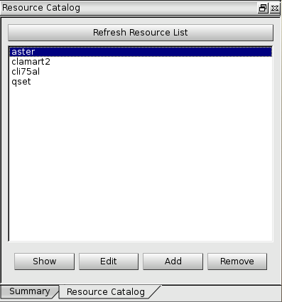
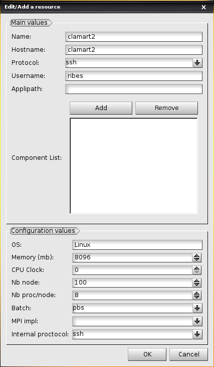

Managing SALOME resources with the JOBMANAGER
=============================================

The JOBMANAGER provides a GUI to manage SALOME resources.
Later in the chapter, we use resource for SALOME resource.

Definition of a SALOME resource
+++++++++++++++++++++++++++++++

A resource is the SALOME abstraction for computer.
A resource contains three different kinds of information:

- A name.
- A physical description of the computer.
- A description of a SALOME installation in the computer.

A resource's name could be different from the computer name since 
different SALOME installation could coexist in the computer.

Types and usage of SALOME resources
-----------------------------------

In SALOME, resources can be used in two different ways:

- Resources can be used to launch containers, either semi-automatically with
  YACS or directly by calling the method GiveContainer of the Container
  Manager (service provided by the KERNEL).
- Resources can be used to launch jobs, either with the JOBMANAGER module or
  with the underlying Launcher service (provided by the KERNEL).

Those two kinds of resources are both managed by the Resource Manager (KERNEL
service). They can both be created and edited with the resource management
interface of the JOBMANAGER. This is why some informations describing the
resources (e.g. CPU clock) are in fact not used at all by the JOBMANAGER to
launch jobs. If you just want to create a resource to launch jobs, you can
safely ignore those parameters.

Physical description of the computer
------------------------------------

A resource contains a physical description of the computer.
These informations are used by the Resource Manager to choose and use a
resource when a container (in YACS) or a job (in JOBMANAGER) has to be
launched.

The description of each attribute is given in the table below. 

**Warning:** The *mandatory* part is for using the resource with the JOBMANAGER.

========================== ================ =============================================================
**Attribute**              **Mandatory**    **Description**
========================== ================ =============================================================
**hostname**               Yes              Network name of the computer. If the computer is a cluster,
                                            you have to give the head node name.
**protocol**               Yes              Network protocol to use for creating connections 
                                            (ssh or rsh).
**username**               Yes              User login on the computer.
**Batch Manager**          No               Type of batch manager installed in the resource. Use *None*
                                            if the resource is a single computer. Some batch managers are
                                            indicated with "limited support". This means that their
                                            support in JOBMANAGER is either new and experimental or
                                            old and obsolete. In both cases, they have not been fully
                                            validated in this version and thus can be buggy or even not
                                            work at all.
**iprotocol**              Yes              Internal protocol to use on a cluster (i.e. the command used
                                            to launch processes on other nodes of the cluster).
**mpiImpl**                No               MPI implementation to use.
**OS**                     No               Operating system name, e.g.: Linux, Windows (not used by
                                            JOBMANAGER)
**nb_node**                No               Number of nodes in the computer (not used by JOBMANAGER)
**nb_proc_per_node**       No               Number of processors or cores in each node (only used with
                                            PBS batch manager)
**mem_mb**                 No               Memory per node in megabytes (not used by JOBMANAGER)
**cpu_clock**              No               Clock rate in gigahertz of the computer's processor(s) (not
                                            used by JOBMANAGER)
**Can launch batch jobs**  Yes              Indicate if the resource can be used to launch batch jobs
                                            (mandatory to use the resource with JOBMANAGER)
**Can run containers**     No               Indicate if the resource can be used to run containers
                                            interactively (from a YACS schema running on the local
                                            machine for instance)
**Working Directory**      No               Base working directory for the resource. The working
                                            directories for the jobs will by default be created as
                                            subdirectories of this directory.
========================== ================ =============================================================

SALOME installation description
-------------------------------

A resource could contain a SALOME installation description.
The description of each attribute is given in the table below.

**Warning:** Attribute **applipath** is *mandatory* with JOBMANAGER SALOME related type of job.

========================== =============================================================
**Attribute**              **Description**
========================== =============================================================
**applipath**              Directory of the SALOME application to use on the resource
**componentList**          List of the SALOME components available in the SALOME 
                           application (not used by JOBMANAGER)
========================== =============================================================

Where is the resource file?
---------------------------

Resources are located into a XML resource file. SALOME tries to find this file
in three different locations:

1. If **USER_CATALOG_RESOURCES_FILE** env file is defined, SALOME uses this file.
2. If not, in the SALOME application directory: $APPLIPATH/CatalogResources.xml.
3. If not, in the directory of the installation of SALOME KERNEL: 
   $KERNEL_ROOT_DIR/share/salome/resources/kernel/CatalogResources.xml.

By default, the resource manager creates a resource named "localhost" with the hostname
of the local computer.

JOBMANAGER resource management GUI
++++++++++++++++++++++++++++++++++

The JOBMANAGER provides a panel to manage user's resources. This panel is shown in the 
figure :ref:`figure_jobmanager_resource_1`. The panel provides some buttons and a list
that shows the available resources. You have to select one resource to enable some buttons.

.. _figure_jobmanager_resource_1:

  **JOBMANAGER resource management panel**

The description of each button is given in the table below.

========================== =============================================================
**Button**                  **Description**
========================== =============================================================
**Refresh Resource List**  Resource file is read to refresh the list.
**Show**                   Show the selected resource.
**Edit**                   Edit the selected resource. The resource is saved is **Ok** 
                           is clicked. If the resource name is changed, a new resource
                           is added.
**Add**                    Add a new resource.
**Remove**                 Remove the selected resource.
========================== =============================================================

The figure :ref:`figure_jobmanager_resource_2` shows the panel of a resource. This panel
shows all the information of a resource.

.. _figure_jobmanager_resource_2:

  **JOBMANAGER resource panel**

Two usage scenarios of SALOME's resource with the JOBMANAGER
++++++++++++++++++++++++++++++++++++++++++++++++++++++++++++

This section describes to common scenarios for understanding how to describe
a resource for the JOBMANAGER.

Using a single machine
----------------------

In this scenario, you need to launch a job on your computer or another single computer
available in your network.

To launch a **command** job you need to fill the following attributes:

- **hostname**
- **protocol** = *ssh*
- **username**
- **Batch Manager** = *None*
- **Can launch batch jobs** = *yes*

**Warning:** You have to configure ssh for allowing ssh commands without asking 
interactive password (RSA or DSA keys).

To launch a **SALOME** type of job, you also need to fill the following attributes:

- **applipath**

Using a cluster managed by a batch system
-----------------------------------------

In this scenario, you need to launch a job into a cluster managed by a batch system.

To launch a **command** job you need to fill the following attributes:

- **hostname**
- **protocol**
- **username**
- **Batch Manager**
- **iprotocol**
- **nb_proc_per_node** (only with PBS batch manager)
- **Can launch batch jobs** = *yes*

**Warning:** You have to configure ssh for allowing ssh commands without asking 
interactive password (RSA or DSA keys) between your computer and the cluster and
eventually between the cluster's nodes.

To launch a **SALOME** command job you also need to fill the following attributes:

- **applipath**
