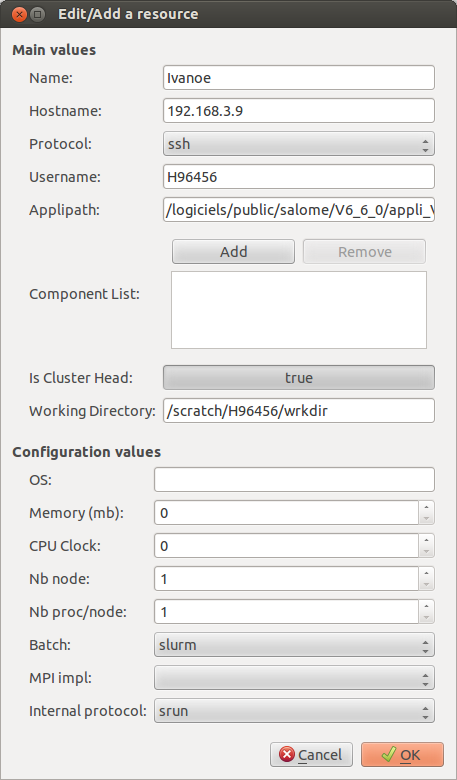

Managing SALOME resources with the JOBAMANAGER
==============================================

The JOBAMANAGER provides a GUI to manage SALOME resources.
Later in the chapter, we use resource for SALOME resource.

Definition of a SALOME resource
+++++++++++++++++++++++++++++++

A resource is the SALOME abstraction for managing computers.
A resource contains three different kinds of informations:

- A name.
- A physical description of the computer.
- A description of SALOME installation in this computer.

A resource's name could be different from the computer name since you could
have different SALOME installation in the computer.

Physical description of the computer
------------------------------------

A resource contains a physical description of the computer.
These informations are used by the resource manager (service provided
by the KERNEL) to choose and to user a resource when a container (in YACS)
or a job (in JOBMANAGER) has to be launched.

The description of each attribute is given in the table below. 

**Warning:** The *mandatory* part is for using the resource with the JOBMANAGER.

========================== ================ =============================================================
**Attribute**              **Mandatory**    **Description**
========================== ================ =============================================================
**hostname**               Yes              It's the network name of the computer. If the computer is a 
                                            cluster, you have to give the frontal computer name.
**protocol**               Yes              Network protocol to use for creating connections 
                                            (ssh or rsh).
**username**               Yes              User name to use for creating connections.
**batch**                  Yes              Type of batch system installed in the resource. Use *ssh* if
                                            the resource is a single computer.
**iprotocol**              Yes              Internal protocol to use on a cluster.
**mpiImpl**                No               MPI implementation to use.

**OS**                     No               It's the operating system name, ex: Linux, Windows, Debian.
**nb_node**                No               It's the amount of node of the computer.
**nb_proc_per_node**       No               It's the amount or processor or core of your computer.
**mem_mb**                 No               It's the amount of memory in megabytes per node.
**cpu_clock**              No               It's the frequency in gigahertz of the computer's processors.
========================== ================ =============================================================

SALOME installation description
-------------------------------

A resource could contain a SALOME installation description.
The description of each attribute is given in the table below.

**Warning:** Attribute **applipath** is *mandatory* with JOBMANAGER SALOME related jobs.

========================== =============================================================
**Attribute**              **Description**
========================== =============================================================
**applipath**              It's the directory of the SALOME application to use into the 
                           resource.
**componentList**          It's the SALOME component list available in the SALOME 
                           application.
========================== =============================================================

Where is the resource file ?
----------------------------

Resources are located into a XML resource file. SALOME tries to find this file
in three different locations:

1. If **USER_CATALOG_RESOURCES_FILE** env file is defined, SALOME uses this file.
2. If not in the SALOME application directory: $APPLIPATH/CatalogResources.xml.
3. If not in the directory of the installation of SALOME KERNEL: 
   $KERNEL_ROOT_DIR/share/salome/resources/kernel/CatalogResources.xml.

By default, the resource manager creates a resource with the name and the hostname of the user computer.

JOBMANAGER resource management GUI
++++++++++++++++++++++++++++++++++

The JOBMANAGER provides a panel to manage the resources. This panel is showned in the 
figure :ref:`figure_jobmanager_resource_1`. The panel provides some buttons and a list
that shows the aviable resources. You can select one resource to enable buttons.

.. _figure_jobmanager_resource_1:

  **JOBMANAGER resource management panel**

The description of each button is given in the table below.

========================== =============================================================
**Button**                  **Description**
========================== =============================================================
**Refresh Resource List**  Resource file is read to refresh the list.
**Show**                   Show the selected resource.
**Edit**                   Edit the selected resource. The resource is saved is **Ok** 
                           is clicked. If the resource name is changed, a new resource
                           is added.
**Add**                    Add a new resource.
**Remove**                 Remove the selected resource.
========================== =============================================================

The figure :ref:`figure_jobmanager_resource_2` shows the panel of a resource. This panel
shows all the informations of a resource.

.. _figure_jobmanager_resource_2:

  **JOBMANAGER resource panel**

Two usage scenarios of SALOME's resource with the JOBMANAGER
++++++++++++++++++++++++++++++++++++++++++++++++++++++++++++

This section describes to common scenarios for understanding how to describe
a resource for the JOBMANAGER.

Using an interactive resource
-----------------------------

In this scenario, you need to launch a job into your computer or an interactive computer
available in your network.

To launch a **command** job you need to fill the following attributes:

- **hostname**
- **protocol** = *ssh*
- **username**
- **batch** = *ssh*

**Warning:** You have configure your ssh for allowing ssh commands without asking 
interactives password (RSA or DSA keys).

To launch a **SALOME** command job you also need to fill the following attributes:

- **applipath**

Using a cluster managed by batch system
---------------------------------------

In this scenario, you need to launch a job into a cluster managed by a batch system.

To launch a **command** job you need to fill the following attributes:

- **hostname**
- **protocol**
- **username**
- **batch**
- **iprotocol**
- **nb_proc_per_node**

**Warning:** You have configure your ssh for allowing ssh commands without asking 
interactives password (RSA or DSA keys) between your computer and the cluster and between
the cluster's nodes.

To launch a **SALOME** command job you also need to fill the following attributes:

- **applipath**

